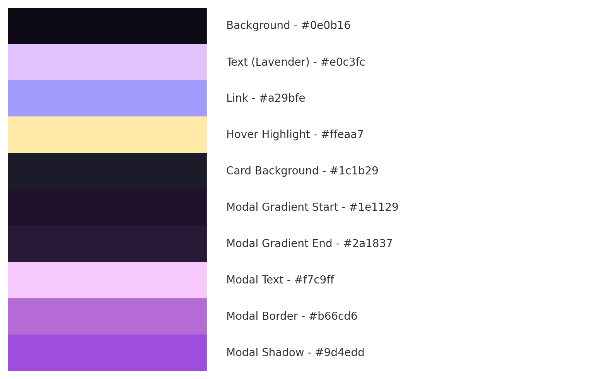

# Hecate’s Moon Witchcraft Shop

Check the website 👉 [Hecate Moon Witchcraft Shop](https://hecatemoon-5d65aa65eed5.herokuapp.com)

---

## Table of Contents

- [Introduction](#introduction)
- [User Stories](#user-stories)
- [Features](#features)
- [Technologies Used](#technologies-used)
- [Design](#design)
  - [CSS Styling](#css-styling)
- [Screenshots](#screenshots)
- [Admin Panel](#admin-panel)
  - [Admin Panel Overview](#admin-panel-overview)
- [Testing](#testing)
  - [Functional Testing](#functional-testing)
  - [HTML Validation](#html-validation)
  - [JavaScript Validation](#javascript-validation)
  - [Python Validation](#python-validation)
- [Deployment](#deployment)
- [Credits and Contact](#credits-and-contact)

---

## Introduction

Hecate’s Moon is an e-commerce platform built with Django where users can purchase handcrafted spell boxes, magical items, and book spiritual services like ritual requests, birth chart readings, and “Ask a Witch” consultations. The project blends mysticism with modern full-stack functionality and supports secure payments, discount codes, user authentication, and more.

---

## User Stories

- As a customer, I want to browse spell boxes with clear images and descriptions.
- As a customer, I want to view magical items in a separate section.
- As a user, I want to book services like birth chart readings and rituals via forms.
- As a user, I want to add products and services to my cart and see a total.
- As a user, I want to check out securely with Stripe.
- As a user, I want to apply discount codes during checkout.
- As a returning user, I want to log in and view my order history.
- As an admin, I want to manage all products and services through the Django admin panel.

---

## Features

| **Feature**              | **Description**                                                                 |
|--------------------------|---------------------------------------------------------------------------------|
| **Homepage**             | Welcoming introduction with a banner and "Shop Now" button                      |
| **Magical Market**       | Displays magical items like crystals, oils, and incense separately              |
| **Spiritual Services**   | Allows users to book personalized services with forms and pricing               |
| **Cart System**          | Add/remove/edit products and services with dynamic total updates                |
| **Stripe Checkout**      | Secure checkout using Stripe Elements and webhooks                             |
| **Promo Code Logic**     | Accepts "MOON10" and "FIRST10" for 10% off                                      |
| **User Accounts**        | Login, logout, register via Django Allauth                                      |
| **Order History**        | Logged-in users can access their past orders                                    |
| **Admin Control**        | Admins can manage all content via the Django admin interface                    |
| **Responsive Design**    | Works seamlessly on mobile, tablet, and desktop                                 |
| **CRUD Functionality**   | Logged-in users can **create** and **purchase** items and services, then **edit** or **cancel** their orders within a 12-hour window. Admins have full CRUD access to all content through the Django admin panel. |

---

## Technologies Used

- **Python 3 / Django 5.2 / changed later to 4.2.16 so cloudinary could work**
- **HTML5 / CSS3 / Bootstrap 5**
- **JavaScript**
- **PostgreSQL**
- **Stripe (Elements + Webhooks)**
- **Cloudinary** (Image/media storage)
- **Heroku** (Deployment)
- **Git / GitHub**
- **Django Allauth**
- **Decouple / dj_database_url / Whitenoise**

---

## Design

- **Color Palette**: The site uses a mystical and elegant palette to reflect Hecate’s underworld and lunar energy:

  

- **Typography**: [Cinzel](https://fonts.google.com/specimen/Cinzel), a mystical serif font, is used for headers to maintain a magical tone.

- **Layout**: Responsive card-based layout using Bootstrap. Equal-height product cards with hover effects and Bootstrap modals.

- **Navigation**: Fixed navbar includes links to:
  - Ritual Boxes
  - Magical Items
  - Services
  - Cart & User Account

- **Imagery**: Cloudinary-optimized visuals support brand identity and loading speed.

- **Modal Effects**: Glow animations, custom borders, and gradients for immersive UX.

---

### CSS Styling

- **Central Styling**: All styles live in `static/css/base.css`
- **Custom Themes**: Bootstrap elements overridden for a witchy aesthetic
- **Effects**: Hover glows and smooth transitions
- **Responsiveness**: Adaptable layout through Bootstrap grid system

> ❌ Wireframes were not included as part of the planning phase. The design evolved organically throughout development based on live feedback and aesthetic testing.

---

## Screenshots

| Screenshot | Description |
|-----------|-------------|
|  | Homepage with banner and mystical mood |
|  | Market page displaying ritual boxes and magical items |
|  | Ritual spell boxes in responsive grid |
|  | Confirmation message after adding to cart |
|  | Empty cart notification |
|  | Cart with total and items |
|  | Stripe-integrated checkout with promo support |
|  | Login page with Allauth form |

---

## Admin Panel

The admin dashboard handles magical and spiritual product management, orders, and users.

### Admin Panel Overview

| Screenshot | Description |
|-----------|-------------|
|  | View full order details including line items |
|  | Individual witch questions with payment status |
|  | Shows content types for flexible order tracking |
|  | Admin view of all ritual boxes |
|  | Admin management of magical items |
|  | View of registered users |
|  | Allauth-managed email addresses |
|  | Admin view of astrological service requests |

---

## Testing

### Functional Testing

| **Test**       | **Expected Result**                      | **Actual Result**        | ✅ |
|----------------|-------------------------------------------|---------------------------|----|
| Stripe Payment | Successful payment + webhook confirmation | Works as expected         | ✅ |
| Promo Codes    | 10% applied if MOON10 or FIRST10 entered  | Works as expected         | ✅ |
| Forms          | Services added correctly to cart          | Fully functional          | ✅ |
| Responsive UX  | All layouts adjust on all screen sizes    | Clean across devices      | ✅ |
| Auth Flow      | Register/login/logout redirects work      | No issues                 | ✅ |

---

### HTML Validation

All major templates validated via [W3C Nu HTML Checker](https://validator.w3.org/nu/).

See [validation screenshots](documentation/testing%20html/) for individual template results.

---

### 📊 Lighthouse Testing

Google Chrome Lighthouse was used to analyze the site’s performance, accessibility, best practices, and SEO. The results below reflect the live Heroku deployment ([hecatemoon-5d65aa65eed5.herokuapp.com](https://hecatemoon-5d65aa65eed5.herokuapp.com)).

| Category       | Score |
|----------------|-------|
| **Performance**    | 81    |
| **Accessibility**  | 95    |
| **Best Practices** | 79    |
| **SEO**            | 90    |

All results were considered successful with no critical issues detected. Minor recommendations for performance and best practices were acknowledged but do not impact user experience.

📸 **Screenshots of Lighthouse Reports:**

| Screenshot | Description |
|------------|-------------|
|  | Full audit overview on homepage |
|  | Detailed Accessibility tab result |
|  | Detailed SEO score and explanation |

---

### JavaScript Validation

Tested via DevTools and [JSHint](https://jshint.com) with `esversion: 6`.

| Script               | Summary                                                                 |
|----------------------|-------------------------------------------------------------------------|
| `cart.js`            | 11 ES6 warnings, no errors — uses modern syntax                         |
| `stripe_elements.js` | Stripe var flagged as undefined (loaded via CDN)                        |
| `modal.js` (inline)  | No errors — localStorage promo popup works perfectly                    |

---

### Python Validation

All Python files passed `flake8`.

| Area            | Notes                                      |
|-----------------|--------------------------------------------|
| All `*.py` files| No critical errors, PEP8 mostly respected  |
| `views.py`      | Clean logic for cart, services, and Stripe |

---

## Deployment

Deployed using Heroku + GitHub integration.

- Buildpacks: `heroku/python`, `cloudinary`
- Env Vars: `SECRET_KEY`, `STRIPE_*`, `CLOUDINARY_URL`, `DATABASE_URL`
- Uses `dj_database_url`, `whitenoise`, `decouple`
- Static/media served via Cloudinary
- Tested live with Stripe and Allauth

🔗 [Live site](https://hecatemoon-5d65aa65eed5.herokuapp.com)

---

## Credits and Contact

### Credits

- Created by **Navah Eierdal** for the **Code Institute Full Stack Software Development Diploma (MS4)**.
- Inspired by goddess Hecate and the mystical world.
- Based on the Django Boutique Ado walkthrough.
- Images by DALL·E and styled through Cloudinary.
- Huge thanks to the cloud for saving this when my laptop died 🙏.

### Contact

- 📧 [navaheierdal92@outlook.com](mailto:navaheierdal92@outlook.com)
- 🐙 GitHub: [NavyBlue06](https://github.com/NavyBlue06)
