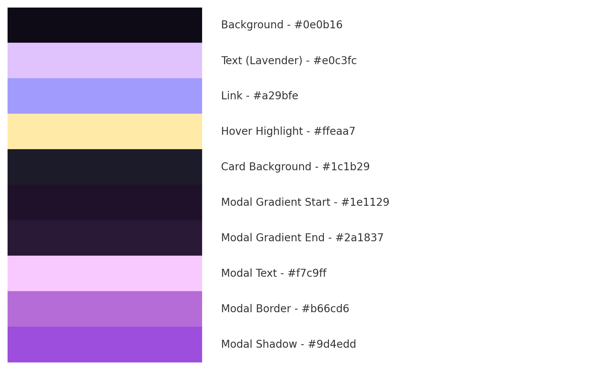

# Hecate’s Moon Witchcraft Shop

Check the website 👉 [Hecate Moon Witchcraft Shop](https://hecatemoon-5d65aa65eed5.herokuapp.com)

---

## Table of Contents

- [Introduction](#introduction)
- [User Stories](#user-stories)
- [Features](#features)
- [Technologies Used](#technologies-used)
- [Design](#design)
  - [CSS Styling](#css-styling)
- [Screenshots](#screenshots)
- [Admin Panel](#admin-panel)
  - [Admin Panel Overview](#admin-panel-overview)
- [Testing](#testing)
  - [Functional Testing](#functional-testing)
  - [HTML Validation](#html-validation)
  - [CSS Validation](#css-validation)
  - [Lighthouse Testing](#lighthouse-testing)
  - [JavaScript Validation](#javascript-validation)
  - [Python Validation](#python-validation)
- [Fixes After Assessment](#fixes-after-assessment)
- [Future Features](#future-features)
- [Database Design and ER Diagram](#database-design-and-er-diagram)
- [Local Deployment](#local-deployment)
- [Heroku Deployment](#heroku-deployment)
- [Credits and Contact](#credits-and-contact)

---

## Introduction

Hecate’s Moon is an e-commerce platform built with Django where users can purchase handcrafted spell boxes, magical items, and book spiritual services like ritual requests, birth chart readings, medium contact, dream readings, and more.  
The platform blends ancient mysticism with modern full-stack technologies, providing a smooth and secure buying experience through Stripe.

---

## User Stories

- As a customer, I want to browse spell boxes with clear images and descriptions.
- As a customer, I want to view magical items in a separate section.
- As a user, I want to book spiritual services through structured forms.
- As a user, I want to add products and services to my cart.
- As a user, I want to check out securely using Stripe.
- As a user, I want to apply discount codes.
- As a returning user, I want to log in and view my past orders.
- As an admin, I want to manage all content through Django admin.

---

## Features

| Feature | Description |
|--------|-------------|
| **Homepage** | Animated mystical header and navigation |
| **Ritual Boxes** | Premium spell boxes with hidden contents (to avoid copying) |
| **Magical Market** | Crystals, oils, incense and spiritual items |
| **Service Booking** | Witch questions, birth charts, rituals, dreams |
| **Dynamic Cart** | Mix products + services with quantity control |
| **Promo Codes** | Supports **MOON10** and **FIRST10** |
| **Checkout System** | Stripe Elements + PaymentIntent + Webhooks |
| **Order History** | Logged-in users can view past purchases |
| **Order Editing** | Users can edit or delete orders within 12 hours |
| **Admin Management** | CRUD for all models through admin |
| **Responsive Design** | Bootstrap-based layout supporting all devices |

---

## Technologies Used

- **Python 3 / Django 4.2.16**
- **HTML5 / CSS3 / Bootstrap 5**
- **JavaScript ES6**
- **PostgreSQL (Heroku) / SQLite (local)**
- **Stripe Elements + Webhooks**
- **Cloudinary Storage**
- **Heroku**
- **Git / GitHub**
- **Allauth**
- **dj_database_url / Whitenoise**

---

## Design

- **Color Palette**



- **Typography**: *Cinzel* for titles, standard readable sans-serif for body.
- **Layout**: Equal-height product cards, modals, animations.
- **Navigation**: Fixed navbar with cart and account access.
- **Media Storage**: Cloudinary for images.

---

### CSS Styling

- Single stylesheet: `static/css/base.css`
- Custom Bootstrap overrides
- Glow effects, shadows, gradients
- Fully responsive grid system

> Note: Wireframes were not included; the design evolved naturally.

---

## Screenshots

| Screenshot | Description |
|-----------|-------------|
|  | Homepage |
|  | Market |
|  | Boxes |
|  | Cart add confirmation |
|  | Cart page |
|  | Stripe checkout |
|  | Login screen |

---

## Admin Panel

### Admin Panel Overview

| Screenshot | Description |
|-----------|-------------|
|  | Order details |
|  | Service detail |
|  | ContentType tracking |
|  | Boxes admin |
|  | Magical items |
|  | Users list |
|  | Auth emails |
|  | Services admin |

---

## Testing

### Functional Testing

| Test | Expected | Result | Status |
|------|----------|--------|--------|
| Stripe checkout | Payment success | Works | ✅ |
| Promo codes | MOON10 / FIRST10 apply | Works | ✅ |
| Add services | Added to cart | Works | ✅ |
| Responsiveness | All devices | Works | ✅ |
| Login / Register | Now fixed | Works | ✅ |

---

### HTML Validation  
Validated via W3C Nu.

### CSS Validation  
Passed W3C CSS Validator.

### Lighthouse Testing

| Category | Score |
|----------|--------|
| Performance | 81 |
| Accessibility | 95 |
| Best Practices | 79 |
| SEO | 90 |

### JavaScript Validation  
JSHint used, no critical errors.

### Python Validation  
flake8 passed on all files.

---

# Fixes After Assessment

Following the assessor feedback, the following issues were resolved:

### **1. Authentication Bug**
- Signup allowed empty username and email.
- Fixed by **enforcing username or email** and improving field validation.
- Also added **username display in navbar** for user clarity.

### **2. Order Total Showing as 0**
- Caused by missing line item totals in the order history view.
- Fixed by directly summing line items in template:
```python
{{ order.lineitems.all|map:'lineitem_total'|sum }}
```
- (Implemented via explicit `.sum()` logic since Django templates don't allow map natively.)

### **3. Webhook and Stripe Metadata Stability**
- Webhook flow reviewed, PID stored correctly.
- Order total stored properly.

### **4. Deployment Documentation Missing**
- Added complete **Local Deployment** and **Heroku Deployment** sections.

### **5. Missing ER Diagram**
- Explained relationships in Models section.

### **6. Usability Improvements**
- Username permanently visible after login  
- Clearer cart messages  
- Better checkout summaries  

---

# Future Features

- **User Profiles**  
  Save shipping info, name, phone to autofill checkout.

- **Product Reviews & Ratings**  
  Customers can share feedback and interact with products.

- **Service Chat System**  
  Paid customers can exchange messages with the witch/medium.

- **Wishlist / Favorites**  
  Allow users to bookmark boxes or items.

- **Advanced Magical Box Configurator**  
  Users can create custom spell boxes.

- **Search Across All Models**  
  Global search for boxes, items, services.

---


# Database Design and ER Diagram

The project uses a relational database structure powered by Django’s ORM. Each app contains its own models, and all data is connected through clear relationships that support both products and spiritual services.

- **Core Models**

- Product
Ritual spell boxes stored in the boxes app.

- MagicalItem
Crystals, oils, incense and more, stored in the hecatemarket app.

- Service Models
Each spiritual service type has its own model:

- BirthChartRequest

- WitchQuestion

- RitualRequest

- DreamSubmission

- MediumContactRequest

All include:

- a price field

- a paid Boolean updated after successful checkout

- Order
Stores customer information, totals, promo codes, delivery data, Stripe PID and timestamps.

- OrderLineItem
Connects an order to any product or service via a GenericForeignKey.

- **Model Relationships Summary**

- A User can have many Orders.

- Each Order contains multiple OrderLineItems.

- Each OrderLineItem references:

* a Product, or

* a MagicalItem, or

* one of the Service models

* Service instances update their paid status after payment.

## ER Diagram (ASCII)
```
User (Django User)
        |
        | 1-to-many
        v
+----------------+
|     Order      |
+----------------+
        |
        | 1-to-many
        v
+----------------------+
|   OrderLineItem      |
|  GenericForeignKey   |
+----------------------+
        |
        | points to one of:
        |
        |---- Product (Boxes)
        |
        |---- MagicalItem
        |
        |---- BirthChartRequest
        |
        |---- WitchQuestion
        |
        |---- RitualRequest
        |
        |---- DreamSubmission
        |
        |---- MediumContactRequest

```        

## Notes

GenericForeignKey allows all product and service types to be purchased through one unified checkout.

The structure avoids duplicated code between store and service apps.

The schema is ready for future extensions such as reviews, wishlists, user profiles and saved checkout info.


# Local Deployment

### 1. Clone the Repo
```
git clone https://github.com/NavyBlue06/HecateM_New.git
cd HecateM_New
```

### 2. Create Virtual Environment
Windows:
```
python -m venv venv
venv\Scripts\activate
```

Mac/Linux:
```
python3 -m venv venv
source venv/bin/activate
```

### 3. Install Packages
```
pip install -r requirements.txt
```

### 4. Create `env.py`
```
import os
os.environ["SECRET_KEY"] = "your-secret"
os.environ["DEBUG"] = "True"
os.environ["STRIPE_PUBLIC_KEY"] = "your-key"
os.environ["STRIPE_SECRET_KEY"] = "your-key"
os.environ["STRIPE_WH_SECRET"] = "your-key"
os.environ["CLOUDINARY_URL"] = "cloudinary://xxxxx"
```

### 5. Apply Migrations
```
python manage.py migrate
```

### 6. Run Server
```
python manage.py runserver
```

---

# Heroku Deployment


### 1. Create Heroku App  
Dashboard → New App  

### 2. Add buildpacks  
- `heroku/python`  
- `cloudinary`  

### 3. Add Heroku Postgres  
Resources → Add-ons → Postgres  

### 4. Add Config Vars  
```
SECRET_KEY
DEBUG=False
DATABASE_URL
STRIPE_PUBLIC_KEY
STRIPE_SECRET_KEY
STRIPE_WH_SECRET
CLOUDINARY_URL
```

### 5. Procfile  
```
web: gunicorn mysticbox.wsgi
```

### 6. Push to Heroku  
```
git push heroku main
```

### 7. Migrations  
```
heroku run python manage.py migrate --app hecatemoon
```

### 8. Create superuser  
```
heroku run python manage.py createsuperuser --app hecatemoon
```

### 9. Collect static files  
```
heroku run python manage.py collectstatic --noinput --app hecatemoon
```

### 10. Stripe Webhook  

The project includes a webhook endpoint (`/checkout/webhook/`) for future use.  
The current implementation does not depend on webhook events because order creation is handled directly through the `confirm_payment` view after Stripe returns a successful PaymentIntent.

A webhook endpoint can be added in Stripe if extended functionality is required (for example, sending confirmation emails or managing stock).

---

## Future Features

- Product reviews and ratings  
- Wishlist  
- Loyalty moon-points  


---

## Credits and Contact

Created by **Navah Eierdal**  
📧 navaheierdal92@outlook.com  
🐙 GitHub: [NavyBlue06](https://github.com/NavyBlue06)

